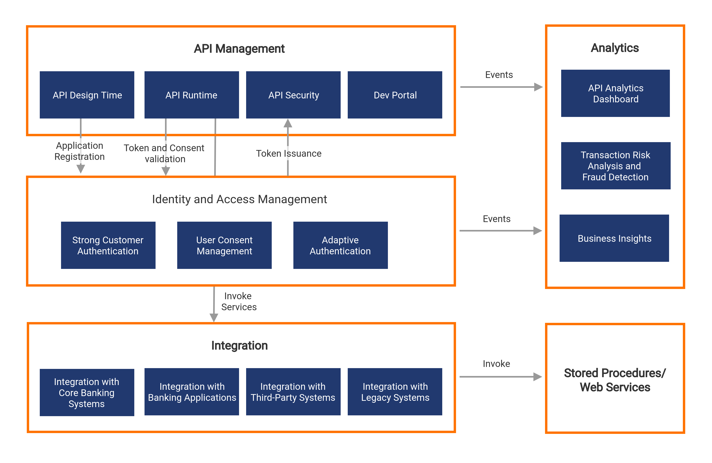

## Overview

WSO2 Open Banking combines the technical capabilities of WSO2 API Manager, WSO2 Identity Server, WSO2 Stream Processor, and WSO2 Enterprise Integrator and supports the technology stack that banks need to become PSD2 and CDR compliant and digitally transformed. 

WSO2 Open Banking leverages five key technology areas critical to a banking infrastructure; API Management, Identity and Access Management, Integration, Analytics and Business Insights, and Fraud Detection bundled together to form a componentized architecture. This gives the flexibility to reuse existing infrastructure, and banks only need to obtain the components that are not available in their current infrastructure. 

## API Management
- Support for Open Banking UK, Berlin Group, Consumer Data Standards, and STET API specifications
- API Management Security with OAuth 2.0 and Mutual SSL including the support for PSD2 eIDAS
- API Publishing and Governance
- API Throttling and Rate Limiting
- API Monitoring and Monetization

## Strong Customer Authentication (SCA)
- Multi-Factor Authentication such as SMS OTP, Email OTP, and Biometrics
- Support for OIDC - Dynamic Linking and Hybrid Flow
- Adaptive Authentication

## Consent Management
- Capabilities to store, validate and revoke consents
- Compliant with Open Banking UK, Berlin Group, Consumer Data Standards, and STET API specifications

## Integration
- Easy integration with the core banking systems
- Support for multiple protocols (REST, SOAP, and WebSocket) and message formats (JSON and XML)

## Third Party Provider Onboarding
- Automatic TPP onboarding
- Workflow-based TPP onboarding

## GDPR Compliance
- Enhancements to consent management, user profile management, forget me, and cookie handling features

## Additional Components
- Risk Management
    - Fraud Detection
    - Transaction Risk Analysis
    - Alerts
